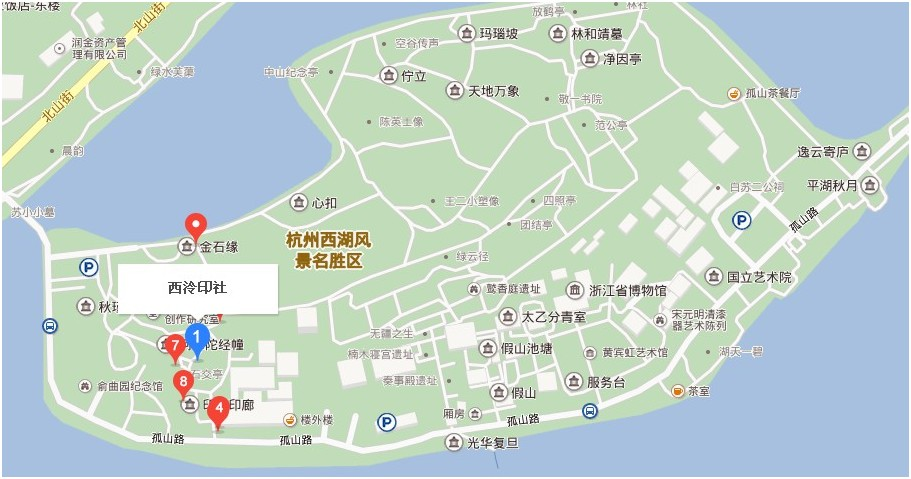

##简介

费用：免费
游玩时间：半天

##特色

子景点很多，如 中山公园、 西泠印社、清朝行宫。可以玩很久

##介绍

孤山位于浙江省杭州市西湖风景区旁，是西湖的一个著名景点。 孤山是西湖中最大的岛屿 ， 面积20公顷，山高38米 ，是文物胜迹荟萃之地。 现有胜景30处 ，走在山间小径颇有 山林的感觉 。
主要景点有：放鹤亭、林和靖墓、西泠印社，玛瑙坡、一眼泉水、文澜阁、中山公园、清行宫、敬一书院、秋瑾墓、六一泉、苏曼殊墓园、敬一书院、六一泉、半壁亭等。

下面是一些主要的区域

孤山的尺寸

#子景点 

### 西泠印社

地理位置：

这里是古代学社，主要是研究印学，书画，纂刻等等，曾经被誉为天下第一名社。西泠印社的地理位置也非常好，临着西湖景区，所以参观的人很多。印社的内部景观，也是一贯的江南风格，亭台楼阁，高低错落有致，景色很优美，宁静，难怪是以前文人的聚集地。

里面是一个小园林，可以上去走走。

###浙江西湖美术馆

参观一些展览的地方

###浙江博物馆

是一个分馆，可以进去看看展览，不要钱。

地理位置：

###放鹤亭

其中 山北麓的放鹤亭是为纪念宋代隐居诗人林和靖而建 ，他有梅妻鹤子之传说。林系杭州人，长期隐居孤山，终身不仕不婚，遂有 以梅为妻，以鹤为子，有“梅妻鹤子”之说 。林死后葬在孤山，鹤在墓前哀鸣而亡。亭内立“鹤舞赋”刻石，碑文为清康熙皇帝临摹明朝董其昌书法的手迹。 亭外广植梅花，为湖上赏梅胜地 。

赏梅地点（摄于2月底）：

###清行宫遗址

清行宫是清代多位帝王出行西湖时的居住之地，目前只是一些零零碎碎用玻璃遮挡展示的遗址，简单看看就行了。

###文澜阁

文澜阁是清代为珍藏《四库全书》而建的七大藏书阁之一，也是江南三阁中唯一幸存的一阁.虽然在浙江省博物馆里面，但其实已经是个独立的庭院了，假山回廊的，细看还有点皇家气派。四库全书现在已经移入浙江省图书馆古籍部了，现在陈列在文澜阁中的是当年配套的书柜。

###平湖秋月

眺望西湖的地方，西湖十景之一

###西湖天下景

人在园中 仿佛置身深山谷底，获得“小中见大”的艺术效果 。其中溪、潭、花、木、亭、桥等布置得疏密有致，参差有序。

就是一个小小的园林，可以稍微休息一下的地方。

地理位置：

预览图：

