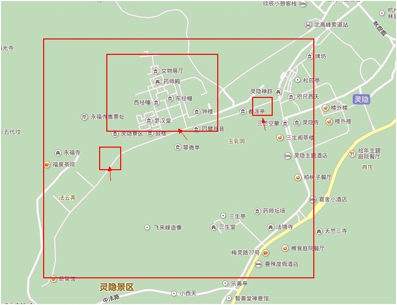
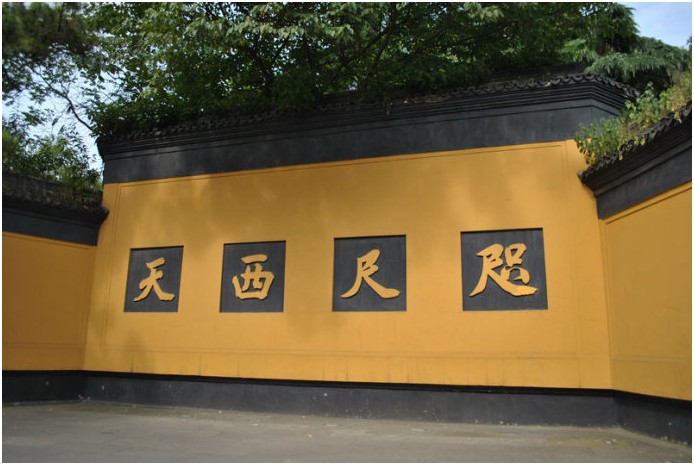
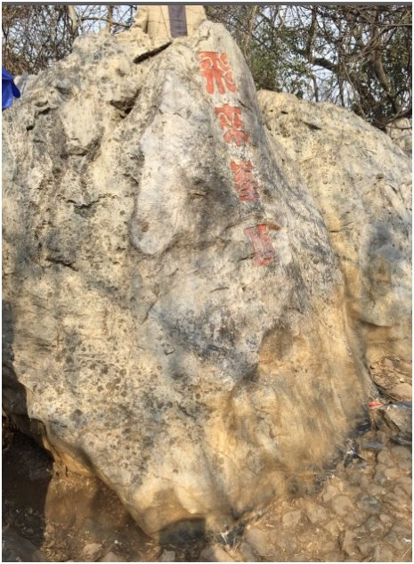
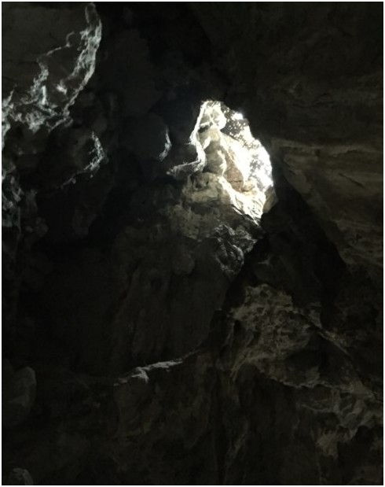
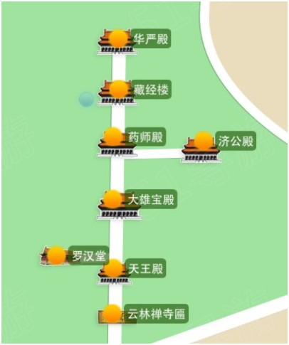

#灵隐寺飞来峰

****

##基本信息

###游玩时间

半天

###玩点

* 观赏飞来峰形态各异的造像

* 去灵隐寺祈福

###门票

去灵隐寺首先得进飞来峰。

飞来峰：45 元,

灵隐寺：30元

共 75 元。 

如果办理了公园卡和寺庙卡，两个景区都是不要钱的。
建议从东边的点进入，可以直接看到飞来峰造像

##地图

东西两个售票处可以进飞来峰景区，然后再从中间的售票处进灵隐寺

##飞来峰

###简介

>杭州灵隐一带的山峰怪石嵯峨，风景绝异，印度僧人慧理称：“此乃中天竺国灵鹫山之小岭，不知何以飞来？”，“飞来峰”由此得来。

<br />

>相传有一天，灵隐寺的济公和尚突然心血来潮，算知有一座山峰就要从 远处飞来，那时，灵隐寺前是个村庄，济公怕飞来的山峰压死人，就奔进村里劝大家赶快离开。村里人因平时看惯济公疯疯颠颠，爱捉弄人，以为这次又是寻大家的 开心，因此谁也没有听他的话。眼看山峰就要飞来，济公急了，就冲进一户娶新娘的人家，背起正在拜堂的新娘子就跑。村人见和尚抢新娘，就都呼喊着追了出来。 人们正追着，忽听风声呼呼，天昏地暗，“轰隆隆”一声，一座山峰飞降灵隐寺前，压没了整个村庄。这时，人们才明白济公抢新娘是为了拯救大家，于是就把此山 峰称为“飞来峰”。

###咫尺西天

这是还没有进飞来峰的时候看到的墙壁

这个是清代的建筑，点示此旁有灵鹫(灵山)，前有天竺，都是古印度佛坐禅说法只处，即西天。

这四个字的含义应该是只要内心虔诚，西天就在你的身边，而不用刻意烧香拜佛。

###飞来峰顶

一个普通的山顶，有一个石头标记。

###飞来峰造像

飞来峰高167米，又叫灵鹫峰。有“武林第一峰”之称。

山石表面没有土覆盖，像是被洗刷了一遍，怪石林立，岩壁空敞，有一种飞动之势。

岩壁上面有从五代、宋、元刻成的470多尊造像。飞来峰造像以元代造像著称，数量之多，规模最大，为国内之最。

>杭州被称为武林是因为杭州建立时(当时是钱塘县,公元前222年,秦朝,秦王统一的第二年),县城在在武林山旁边,由此得名,武林山现在称为灵隐山

###龙泓洞

传说洞中有龙，北宋诗人郭祥正有诗：“洞口无凡木，阴森夏亦寒，谁知一泓水，曾有老龙蟠”。右侧有

一个很深的小洞，传说从前有人从里面采集钟乳石，听到有风浪的声音，被吓跑了。所以有人说这个洞可以通往钱塘江，

洞顶有一个口子，像一口井，叫做通天洞。

###龙泓洞左侧

透过岩石可以看到一线天光，叫做“一线天”。

>一线天和龙泓洞区别不大，而且两个地方靠在一起，所以容易混淆。

###冷泉

将飞来峰和灵隐寺分隔开，水势波涛激荡。夏天可以在冷泉亭乘凉。

<br />

##灵隐寺

###简介

>灵隐寺始建于东晋咸和元年（公元326年），至今已有约一千七百年的历史，为杭州最早的名刹。灵隐寺地处杭州西湖以西，背靠北高峰，面朝飞来峰，两峰挟峙，林木耸秀，深山古寺，云烟万状。 灵隐寺开山祖师为西印度僧人慧理和尚。他在东晋咸和初，由中原云游入浙，至武林（即今杭州），见有一峰而叹曰：“此乃中天竺国灵鹫山一小岭，不知何代飞来？佛在世日，多为仙灵所隐。”遂于峰前建寺，名曰灵隐。

###地图

### 天王殿

* 供奉的是弥勒菩萨，他背后是韦陀披萨，代表降服世间的一切邪恶势力

* 手拿琵琶的是东方持国天王

* 手拿宝剑的是南方增长天王

* 手臂缠龙的是西方广目天王

* 手握银鼠的是北方多闻天王

* 他们拿的法器分别代表风、调、雨、顺

###罗汉堂

里面供奉了500尊青铜罗汉像，每一尊高1.7米，底座宽1.3米，重一吨。

他们是佛陀身边的500位常随弟子。

中央是一座佛教四大名山铜殿，是由铜雕工艺美术大师朱炳仁创作的。

* 里面供奉了五台山文殊菩萨、峨眉山普贤菩萨、普陀山观音菩萨、九华山地藏菩萨。

* 在佛教中，这四大菩萨分班象征大智、大行、大悲、大愿。

###大雄宝殿

莲花座上的是释迦摩尼，佛祖两眼向前凝视，右手微微抬起，仿佛正在说法。

释迦摩尼具有强大的力量，成为“大雄”，也就是一切无畏的大力士的意思。

* 殿内东西两侧是“二十诸天”，是诸位尊天的简称，他们是掌管日、月、地、水、电、火、雨、风、富的天神。

* 后面东西的坐像是”十二圆觉“，是圆满觉悟的意思，是佛祖的十二位大弟子。

* 佛像后面的五十三参海岛立体雕塑，有佛像150尊，表现了善财童子南游，历经千辛万苦，参拜了53位名师，终于修得佛果的意思。

###药师殿

* 莲台上坐的是药师佛。

* 左边站立的是日光菩萨，手托太阳，象征光明。

* 右边站立的是月光菩萨，手托月亮，象征清凉。

* 他们合成“东方三圣”

###华严殿

最高的一座殿。

* 里面三座佛像用一根珍贵巨大的楠木雕刻而成。高13米

* 手结毗（pi）印的是毗卢遮那佛

* 手持莲华的是大智文殊师利菩萨

* 手持如意的是大行普贤菩萨

* 三者都是华严世界的圣人，又称”华严三圣“

>华严世界就是华藏世界，又名莲华藏世界。记载源于华严经，法身佛毘卢遮那的净土。以大莲花中包藏微尘数的世界，以此得名。（华、花两字通假）

华藏世界包括极乐世界

